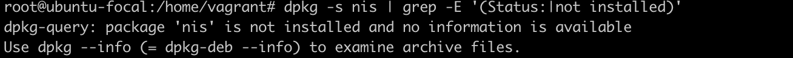

# **Exercise 7**

### **10 CIS Benchmark Task**

<li> Ensure ufw is installed (Automated)
 
 

*See the screenshot below*
 

 
 

<li> Ensure iptables-persistent is not installed with ufw (Automated)
 
 

*See the screenshot below*
 

 
 

<li> Ensure ufw default deny firewall policy (Automated)
 
 

*See the screenshot below*
 

 
 

<li> Ensure iptables firewall rules exist for all open ports (Automated)
 
 

*See the screenshot below*
 

 
 

<li> Ensure ip6tables loopback traffic is configured (Automated)
 
 

*See the screenshot below*
 

 
 

<li> Ensure NIS Client is not installed (Automated)
 
 

*See the screenshot below*
 

 
 

<li> Ensure rsh Client is not installed (Automated)
 
 

*See the screenshot below*
 

 
 

<li> Ensure auditd is installed (Automated)
 
 

*See the screenshot below*
 

 
 

<li> Ensure auditd service is enabled (Automated)
 
 

*See the screenshot below*
 

 
 

<li> Ensure audit log storage size is configured (Automated)
 
 

*See the screenshot below*
 

 
 